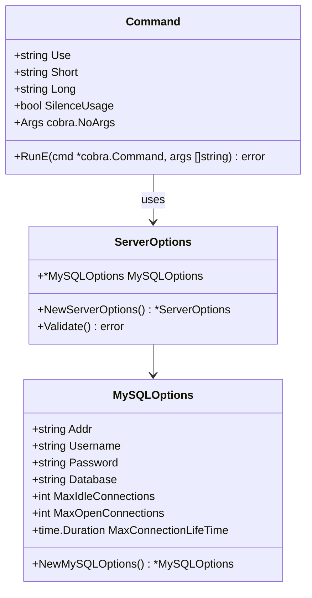

# 类图

根据代码分析，`fg-apiserver`的类图如下：

类图说明：

1. `MySQLOptions`：MySQL 数据库配置选项类
   - 包含数据库连接相关的配置属性
   - 提供 `NewMySQLOptions()` 方法创建默认实例

2. `ServerOptions`：服务器配置选项类
   - 包含 MySQL 配置选项
   - 提供 `NewServerOptions()` 方法创建默认实例
   - 提供 `Validate()` 方法验证配置的合法性

3. `Command`：应用程序命令类（基于 cobra.Command）
   - 定义命令的基本信息（名称、描述等）
   - 包含命令执行逻辑
   - 使用 `ServerOptions` 管理配置

这个类图展示了 `fg-apiserver` 的核心组件及其关系：

- `ServerOptions` 聚合了 `MySQLOptions`，表示服务器配置包含 MySQL 配置
- `Command` 使用 `ServerOptions` 来管理和验证配置

整体设计采用了组合模式，通过不同的 Options 类来管理不同模块的配置，便于扩展和维护。
