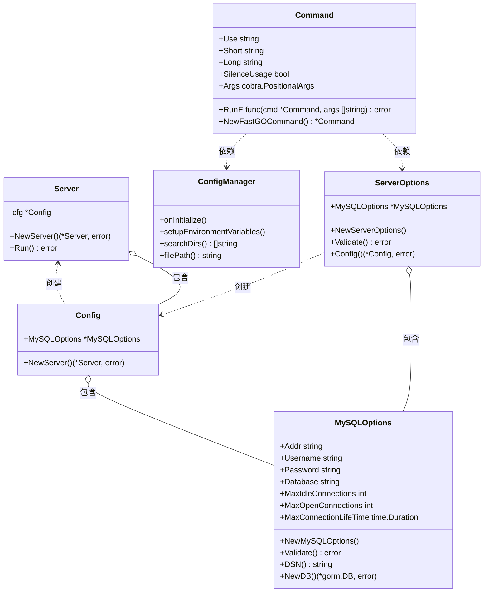

# 类图

根据代码分析，`fastgo` 项目的核心类结构如下：

类图说明：

1. **Server 类**
   - 核心服务器类
   - 持有配置信息
   - 负责服务器的运行

2. **Config 类**
   - 应用配置类
   - 包含 MySQL 配置
   - 负责创建服务器实例

3. **ServerOptions 类**
   - 服务器选项类
   - 包含 MySQL 选项
   - 提供配置验证和转换

4. **MySQLOptions 类**
   - MySQL 配置类
   - 管理数据库连接参数
   - 提供数据库连接功能

5. **Command 类**
   - 命令行接口类
   - 基于 Cobra 框架
   - 处理命令行参数和配置

6. **ConfigManager 类**
   - 配置管理类
   - 处理配置文件加载
   - 管理环境变量

关系说明：

- `Server` 和 `Config` 是组合关系，`Server` 通过配置创建和运行
- `Config` 和 `MySQLOptions` 是组合关系，用于管理 MySQL 配置
- `ServerOptions` 和 `MySQLOptions` 是组合关系，用于验证和转换配置
- `Command` 依赖 `ServerOptions` 和 `ConfigManager` 处理配置
- `ServerOptions` 负责创建 `Config`
- `Config` 负责创建 `Server`
